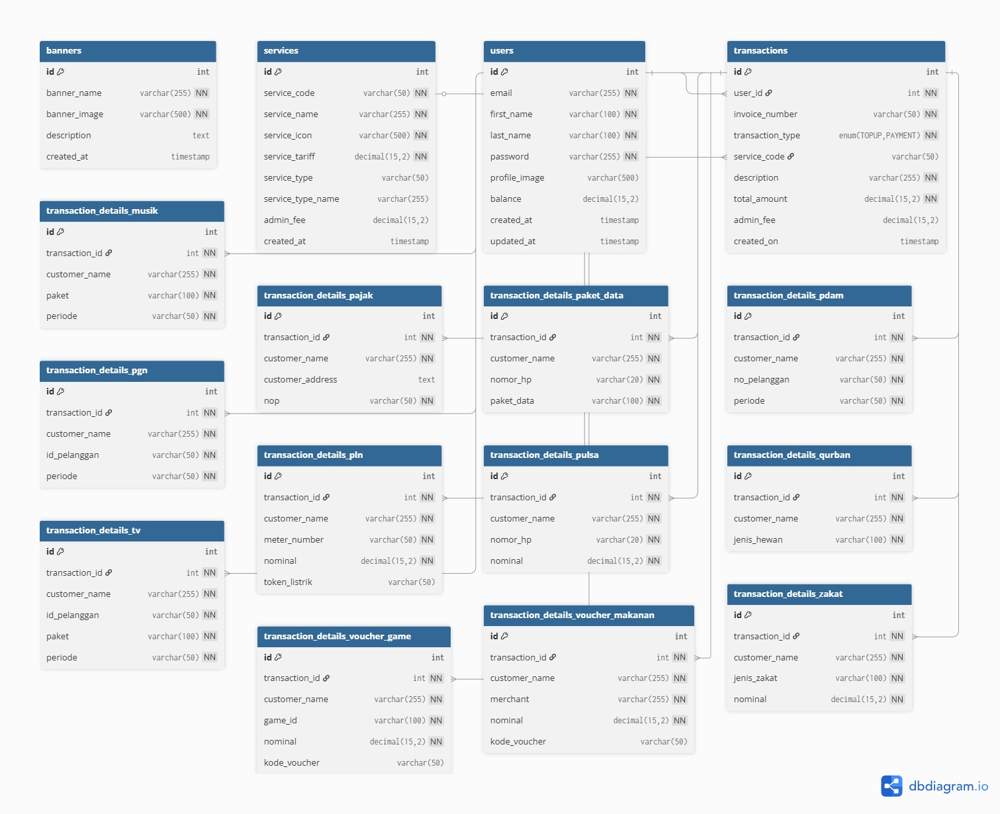

# SIMS PPOB API

API untuk Sistem Informasi Manajemen SIMS PPOB (Payment Point Online Bank) menggunakan Express.js dan MySQL.

## <a id="features"></a>Fitur

- **Registrasi User**: Endpoint untuk mendaftarkan user baru dengan validasi email dan password
- **Login**: Endpoint untuk autentikasi user dengan JWT token
- **Profile Management**: Endpoint untuk mendapatkan, mengupdate profile, dan upload gambar profile
- **Banner Information**: Endpoint untuk mendapatkan list banner (public)
- **Services Information**: Endpoint untuk mendapatkan list layanan PPOB dengan informasi admin fee (private)
- **Balance Management**: Endpoint untuk cek saldo, top up, dan transaksi pembayaran dengan admin fee
- **Transaction History**: Endpoint untuk mendapatkan riwayat transaksi dengan pagination
- **JWT Authentication**: Sistem autentikasi menggunakan JSON Web Token dengan masa berlaku 12 jam
- **MySQL Database**: Menggunakan raw queries untuk interaksi dengan database
- **File Upload**: Mendukung upload gambar profile dengan format JPEG dan PNG
- **Admin Fee System**: Sistem biaya admin yang dapat dikonfigurasi per service dari database
- **Transaction Details**: Sistem penyimpanan detail transaksi terpisah per jenis layanan PPOB
- **Invoice Generation**: Sistem generate invoice dengan format sesuai standar PPOB
- **Service-Specific Tables**: 12 tabel detail transaksi terpisah untuk setiap jenis layanan

## <a id="structure"></a>Struktur Folder

```
├── config/           # Konfigurasi database
├── controllers/      # Logic untuk menangani request
├── middleware/       # Middleware autentikasi
├── models/          # Model untuk operasi database
├── routes/          # Definisi routes API
├── utils/           # Utility functions (termasuk invoice generator)
├── uploads/         # Folder untuk menyimpan gambar profile
├── app.js           # File utama aplikasi
├── package.json     # Dependencies dan scripts
├── .env.example     # Template environment variables
├── create_tables.sql # SQL script untuk membuat tabel database
├── cuurent_data.sql # SQL script dengan data terbaru dan struktur tabel detail
├── invoice.txt      # Format invoice dan struktur database PPOB
└── README.md        # Dokumentasi API
```

## <a id="installation"></a>Instalasi

1. **Clone repository ini**
   ```bash
   git clone <repository-url>
   cd sims-ppob-api
   ```

2. **Install dependencies**
   ```bash
   npm install
   ```

3. **Setup database**
     - Buat database MySQL baru
     - Jalankan script SQL dari `create_tables.sql` untuk membuat tabel dan data awal
     - Jika menggunakan database existing, jalankan `cuurent_data.sql` untuk update struktur database dengan tabel detail transaksi dan data terbaru

4. **Konfigurasi environment**
   - Copy `.env.example` ke `.env`
   - Sesuaikan konfigurasi database dan JWT secret di file `.env`

5. **Jalankan aplikasi**
   ```bash
   npm start
   # atau untuk development
   npm run dev
   ```

## <a id="api-endpoints"></a>API Endpoints

### <a id="membership"></a>1. Module Membership

#### POST /registration
**Type**: Public (Tidak perlu token)
**Input**:
```json
{
  "email": "user@nutech-integrasi.com",
  "first_name": "User",
  "last_name": "Nutech",
  "password": "abcdef1234"
}
```
**Output Success**:
```json
{
  "status": 0,
  "message": "Registrasi berhasil silahkan login",
  "data": null
}
```
**Output Error**:
```json
{
  "status": 102,
  "message": "Parameter email tidak sesuai format",
  "data": null
}
```

#### POST /login
**Type**: Public (Tidak perlu token)
**Input**:
```json
{
  "email": "user@nutech-integrasi.com",
  "password": "abcdef1234"
}
```
**Output Success**:
```json
{
  "status": 0,
  "message": "Login Sukses",
  "data": {
    "token": "eyJhbGciOiJIUzI1NiIsInR5cCI6IkpXVCJ9..."
  }
}
```
**Output Error**:
```json
{
  "status": 103,
  "message": "Username atau password salah",
  "data": null
}
```

#### GET /profile
**Type**: Private (Perlu Bearer Token JWT)
**Input**: Header `Authorization: Bearer {token}`
**Output Success**:
```json
{
  "status": 0,
  "message": "Sukses",
  "data": {
    "email": "user@nutech-integrasi.com",
    "first_name": "User",
    "last_name": "Nutech",
    "profile_image": "https://yoururlapi.com/profile.jpeg"
  }
}
```

#### PUT /profile/update
**Type**: Private (Perlu Bearer Token JWT)
**Input**: Header `Authorization: Bearer {token}`
```json
{
  "first_name": "User Edited",
  "last_name": "Nutech Edited"
}
```
**Output Success**:
```json
{
  "status": 0,
  "message": "Update Pofile berhasil",
  "data": {
    "email": "user@nutech-integrasi.com",
    "first_name": "User Edited",
    "last_name": "Nutech Edited",
    "profile_image": "https://yoururlapi.com/profile.jpeg"
  }
}
```

#### PUT /profile/image
**Type**: Private (Perlu Bearer Token JWT)

**Input**:
- Header: `Authorization: Bearer {token}`
- Body (form-data):
  - Field: `file` (wajib)
  - Tipe file yang didukung: `image/jpeg`, `image/png`
  - Ukuran maksimum file: `5MB`
  - Catatan: Nama field harus `file`

**Contoh Request (cURL)**:
```sh
curl -X PUT http://localhost:3000/profile/image \
  -H "Authorization: Bearer {token}" \
  -F "file=@/path/to/profile.jpg"
```

**Output Success**:
```json
{
  "status": 0,
  "message": "Update Profile Image berhasil",
  "data": {
    "email": "user@nutech-integrasi.com",
    "first_name": "User Edited",
    "last_name": "Nutech Edited",
    "profile_image": "https://yoururlapi.com/profile-updated.jpeg"
  }
}
```

**Output Error (Format tidak sesuai / tanpa file)**:
```json
{
  "status": 102,
  "message": "Format Image tidak sesuai",
  "data": null
}
```

**Output Error (Ukuran file terlalu besar)**:
```json
{
  "status": 102,
  "message": "Ukuran file terlalu besar",
  "data": null
}
```

### <a id="information"></a>2. Module Information

#### GET /banner
**Type**: Public (Tidak perlu token)
**Input**: -
**Output Success**:
```json
{
  "status": 0,
  "message": "Sukses",
  "data": [
    {
      "banner_name": "Banner 1",
      "banner_image": "https://nutech-integrasi.app/dummy.jpg",
      "description": "Lerem Ipsum Dolor sit amet"
    }
  ]
}
```

#### GET /services
**Type**: Private (Perlu Bearer Token JWT)
**Input**: Header `Authorization: Bearer {token}`
**Output Success**:
```json
{
  "status": 0,
  "message": "Sukses",
  "data": [
    {
      "service_code": "PAJAK",
      "service_name": "Pajak PBB",
      "service_icon": "https://nutech-integrasi.app/dummy.jpg",
      "service_tariff": 40000,
      "service_type": "PAJAK",
      "service_type_name": "Pajak PBB",
      "admin_fee": 2500
    }
  ]
}
```

### <a id="transaction"></a>3. Module Transaction

#### GET /balance
**Type**: Private (Perlu Bearer Token JWT)
**Input**: Header `Authorization: Bearer {token}`
**Output Success**:
```json
{
  "status": 0,
  "message": "Get Balance Berhasil",
  "data": {
    "balance": 1000000
  }
}
```

#### POST /topup
**Type**: Private (Perlu Bearer Token JWT)
**Input**: Header `Authorization: Bearer {token}`
```json
{
  "top_up_amount": 1000000
}
```
**Output Success**:
```json
{
  "status": 0,
  "message": "Top Up Balance berhasil",
  "data": {
    "balance": 2000000
  }
}
```
**Output Error**:
```json
{
  "status": 102,
  "message": "Parameter amount hanya boleh angka dan tidak boleh lebih kecil dari 0",
  "data": null
}
```
**Output Error**:
```json
{
  "status": 102,
  "message": "Paramter amount hanya boleh angka dan tidak boleh lebih kecil dari 0",
  "data": null
}
```

#### POST /transaction
**Type**: Private (Perlu Bearer Token JWT)
**Input**: Header `Authorization: Bearer {token}`

**Contoh Input untuk berbagai layanan PPOB:**

**PAJAK (Pajak PBB)**:
```json
{
  "service_code": "PAJAK",
  "customer_name": "Budi Santoso",
  "customer_address": "Jl. Melati No. 10, Jakarta",
  "nop": "32.75.080.012.001-1234.0"
}
```

**PLN (Listrik)**:
```json
{
  "service_code": "PLN",
  "customer_name": "Andi Wijaya",
  "meter_number": "12345678901",
  "nominal": 10000
}
```

**PDAM (Air)**:
```json
{
  "service_code": "PDAM",
  "customer_name": "Rina Kurnia",
  "no_pelanggan": "PDAM123456",
  "periode": "10-2025"
}
```

**PULSA**:
```json
{
  "service_code": "PULSA",
  "customer_name": "Dewi Lestari",
  "nomor_hp": "081234567890",
  "nominal": 40000
}
```

**PGN (Gas)**:
```json
{
  "service_code": "PGN",
  "customer_name": "Ahmad Fauzi",
  "id_pelanggan": "PGN998877",
  "periode": "10-2025"
}
```

**MUSIK (Berlangganan)**:
```json
{
  "service_code": "MUSIK",
  "customer_name": "Tania Puspita",
  "paket": "Premium",
  "periode": "1 Bulan"
}
```

**TV (Berlangganan)**:
```json
{
  "service_code": "TV",
  "customer_name": "Fajar Hidayat",
  "id_pelanggan": "TV00991",
  "paket": "Gold",
  "periode": "1 Bulan"
}
```

**PAKET_DATA**:
```json
{
  "service_code": "PAKET_DATA",
  "customer_name": "Sinta Dewi",
  "nomor_hp": "081234567890",
  "paket_data": "10GB"
}
```

**VOUCHER_GAME**:
```json
{
  "service_code": "VOUCHER_GAME",
  "customer_name": "Rizky Saputra",
  "game_id": "PUBG12345",
  "nominal": 100000
}
```

**VOUCHER_MAKANAN**:
```json
{
  "service_code": "VOUCHER_MAKANAN",
  "customer_name": "Citra Anggraini",
  "merchant": "FoodHub",
  "nominal": 100000
}
```

**QURBAN**:
```json
{
  "service_code": "QURBAN",
  "customer_name": "Hendra Gunawan",
  "jenis_hewan": "Kambing"
}
```

**ZAKAT**:
```json
{
  "service_code": "ZAKAT",
  "customer_name": "Nuraini",
  "jenis_zakat": "Zakat Mal",
  "nominal": 300000
}
```

**Output Success** (contoh untuk PULSA):
```json
{
  "status": 0,
  "message": "Transaksi berhasil",
  "data": {
    "invoice_number": "PULSA-17082023001-123",
    "service_code": "PULSA_PRABAYAR",
    "service_name": "Pulsa Prabayar",
    "transaction_type": "PAYMENT",
    "total_amount": 40000,
    "admin_fee": 1000,
    "customer_name": "Dewi Lestari",
    "nomor_hp": "081234567890",
    "nominal": 40000,
    "created_on": "2023-08-17T10:10:10.000Z"
  }
}
```
**Output Error**:
```json
{
  "status": 102,
  "message": "Service atau Layanan tidak ditemukan",
  "data": null
}
```
**Output Error Balance**:
```json
{
  "status": 102,
  "message": "Balance tidak mencukupi",
  "data": null
}
```
**Output Error Amount**:
```json
{
  "status": 102,
  "message": "Parameter amount hanya boleh angka dan tidak boleh lebih kecil dari 0",
  "data": null
}
```

#### GET /transaction/history
**Type**: Private (Perlu Bearer Token JWT)
**Input**: Header `Authorization: Bearer {token}`, Query params: `offset` (default: 0), `limit` (default: all)
**Output Success**:
```json
{
  "status": 0,
  "message": "Get History Berhasil",
  "data": {
    "offset": 0,
    "limit": 3,
    "records": [
      {
        "invoice_number": "TOPUP-17082023001-456",
        "transaction_type": "TOPUP",
        "description": "Top Up balance",
        "total_amount": 100000,
        "admin_fee": 0,
        "created_on": "2023-08-17T10:10:10.000Z"
      },
      {
        "invoice_number": "PLN-17082023002-789",
        "transaction_type": "PAYMENT",
        "description": "PLN Pascabayar",
        "total_amount": 10000,
        "admin_fee": 1500,
        "created_on": "2023-08-17T11:10:10.000Z"
      }
    ]
  }
}
```

## <a id="response-format"></a>Response Format

Semua response menggunakan format standar:
```json
{
  "status": 0,
  "message": "Pesan response",
  "data": {} // atau null
}
```

## <a id="error-codes"></a>Error Codes

- `0`: Sukses
- `102`: Parameter tidak valid / format salah
- `103`: Username atau password salah
- `108`: Token tidak valid atau kadaluwarsa
- `500`: Error server


## <a id="database"></a>Struktur Database Terbaru

### Tabel Utama:
- **users**: Data pengguna dengan balance
- **services**: Layanan PPOB dengan admin_fee per service
- **transactions**: Transaksi utama dengan admin_fee
- **banners**: Banner informasi

### Tabel Detail Transaksi (12 tabel):
- `transaction_details_pajak` - Detail pajak PBB
- `transaction_details_pln` - Detail pembelian token listrik
- `transaction_details_pdam` - Detail pembayaran PDAM
- `transaction_details_pulsa` - Detail pembelian pulsa
- `transaction_details_pgn` - Detail pembayaran PGN
- `transaction_details_musik` - Detail langganan musik
- `transaction_details_tv` - Detail langganan TV
- `transaction_details_paket_data` - Detail paket data
- `transaction_details_voucher_game` - Detail voucher game
- `transaction_details_voucher_makanan` - Detail voucher makanan
- `transaction_details_qurban` - Detail pembayaran qurban
- `transaction_details_zakat` - Detail pembayaran zakat

Setiap tabel detail memiliki foreign key ke tabel `transactions` dan menyimpan field-field spesifik sesuai jenis layanan PPOB.

### Skema Relasi Database



